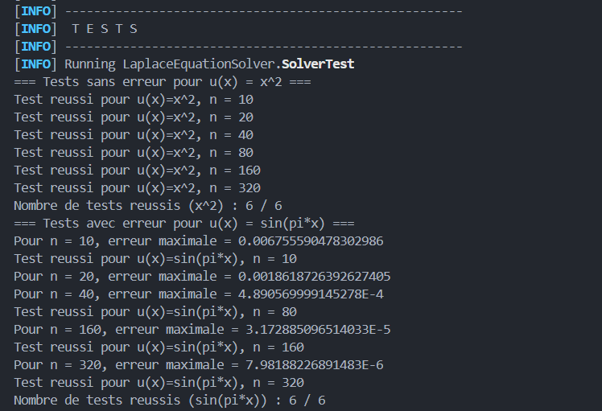

# Projet Laplace Equation Solver

Ce projet implémente un solveur pour l'équation de Laplace en une dimension en utilisant la méthode des différences finies.

## Prérequis

Avant d'exécuter les tests, assurez-vous d'avoir installé les éléments suivants :

- **Java 17** ou une version compatible
- **Apache Maven** (au moins la version 3.6.0)
- Un IDE compatible avec Maven (ex : IntelliJ IDEA, Eclipse, VS Code) ou un terminal

## Installation


Assurez-vous que les dépendances Maven sont bien installées :

```sh
mvn clean install
```

## Exécution des tests

Les tests unitaires sont implémentés dans la classe `SolverTest.java` avec JUnit. Pour exécuter les tests, utilisez la commande suivante :

```sh
mvn test
```

Cela lancera toutes les méthodes annotées avec `@Test` dans `SolverTest.java`, notamment :

- `withoutError()`: teste le solveur avec la fonction exacte `u(x) = x^2` (sans erreur).
- `withError()`: teste le solveur avec la fonction `u(x) = sin(pi*x)`, où une erreur de troncature est attendue.

### Vérification des résultats

- Si tous les tests réussissent, Maven affichera `BUILD SUCCESS`.
- Si un test échoue, Maven affichera `BUILD FAILURE` avec les détails de l'erreur.

Vous pouvez également exécuter un test spécifique avec :

```sh
mvn -Dtest=SolverTest test
```

Ou exécuter une méthode spécifique du test :

```sh
mvn -Dtest=SolverTest#withoutError test
```

## Débogage et logs

Si vous souhaitez voir plus de détails sur l'exécution des tests, utilisez :

```sh
mvn test -X
```

Voila ce qui doit etre affiche apres les tests reunssis



Bonne utilisation ! 🚀

